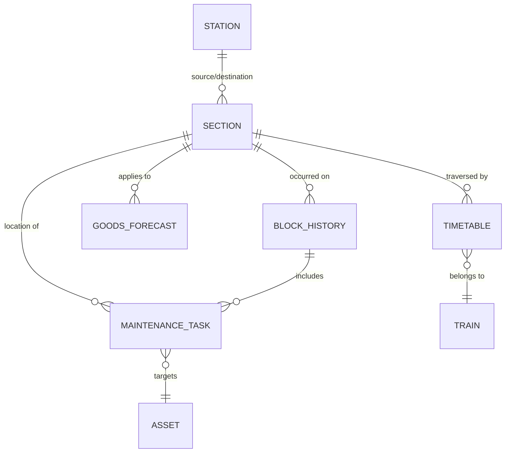

# SYNTHETIC DATA FOR SIH PS 26027

> **Disclaimer**: This is synthetic data generated for development and testing purposes. It does not represent actual operational data from Indian Railways.

## Overview
This repository contains the data schema and synthetic datasets for the **AI-Powered Automatic Block Planning** project. The synthetic data is designed to mirror the complexities of real-world railway operations, providing necessary inputs for predictive maintenance and block optimization algorithms.

## Dataset Descriptions

The system generates 7 core raw datasets, which correspond to various facets of railway operations:

1. **railway_network.csv**: Defines the track topology, sections, stations, capacities, and electrification status.
2. **railway_timetable.csv**: Contains the scheduled passenger and freight train movements, including arrival/departure times at stations.
3. **engineering_maintenance.csv**: Logs track and civil engineering maintenance tasks, including defects, severity, and resource requirements.
4. **traction_maintenance.csv**: Details OHE (Overhead Equipment) and electrical maintenance tasks, indicating if power blocks are required.
5. **signalling_maintenance.csv**: Details signalling and telecom maintenance tasks, indicating if signal blocks are required.
6. **goods_train_forecast.csv**: Provides probabilistic forecasts of freight train traffic within 2-hour windows for different track sections.
7. **maintenance_block_history.csv**: Records historical data of granted maintenance blocks, capturing efficiency, delays, and task completion rates.

## Data Relationships



## Directory Structure

```text
data/
├── README.md
├── DATA_DICTIONARY.md
├── raw/
│   ├── railway_network.csv
│   ├── railway_timetable.csv
│   ├── engineering_maintenance.csv
│   ├── traction_maintenance.csv
│   ├── signalling_maintenance.csv
│   ├── goods_train_forecast.csv
│   └── maintenance_block_history.csv
├── processed/
│   ├── railway_network_processed.csv
│   ├── railway_timetable_processed.csv
│   ├── engineering_maintenance_processed.csv
│   ├── traction_maintenance_processed.csv
│   ├── signalling_maintenance_processed.csv
│   ├── goods_train_forecast_processed.csv
│   ├── maintenance_block_history_processed.csv
│   ├── maintenance_ml_dataset.csv
│   ├── optimization_input.csv
│   └── train_occupancy.csv
```

## How to Regenerate

The datasets can be regenerated using the scripts provided in the `src/data` directory:

```bash
# 1. Generate the core raw datasets
python src/data/generate_data.py

# 2. Validate the generated data against defined constraints
python src/data/validate_data.py

# 3. Apply preprocessing and clean up missing/invalid entries
python src/data/preprocess.py

# 4. Extract features for ML models and optimizer
python src/data/feature_engineering.py
```

## How to Validate

After generation, you can validate the data integrity, id formatting, and relationship constraints by running:
```bash
python src/data/validate_data.py
```

## Configuration

The data generation process is driven by `config/data_config.yaml`. You can modify parameters such as the number of stations, trains, and maintenance tasks to scale the generated dataset size:
```yaml
seed: 42
num_stations: 50
num_sections: 75
num_trains: 200
num_assets: 1000
num_maintenance_tasks: 12000
history_months: 12
```

## ML Usage

The dataset `maintenance_ml_dataset.csv` is specifically engineered for training the **XGBoost priority prediction** model. It consolidates task information, historical failure rates, traffic density, and safety impacts into a single matrix.

## Optimizer Usage

The optimizer (built with **OR-Tools**) consumes the following files to produce the final block schedules:
- `optimization_input.csv`: Contains the prioritized list of tasks and their constraints (deadlines, durations, required blocks).
- `train_occupancy.csv`: Defines the free time windows between scheduled trains.
- `railway_network_processed.csv`: Provides the topology and capacity limits for scheduling.
